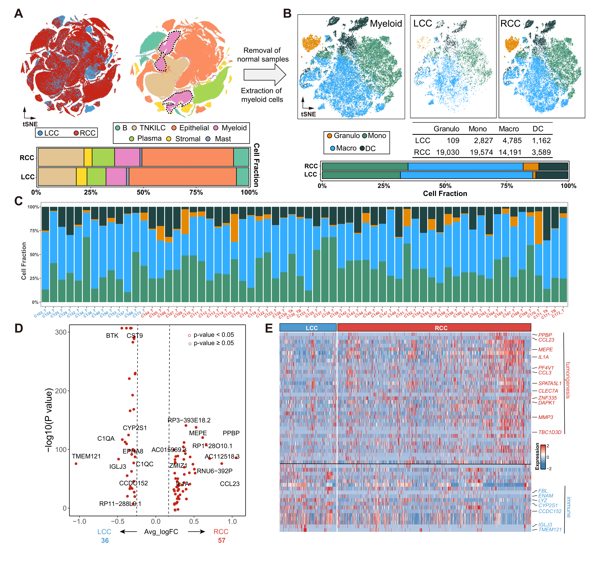
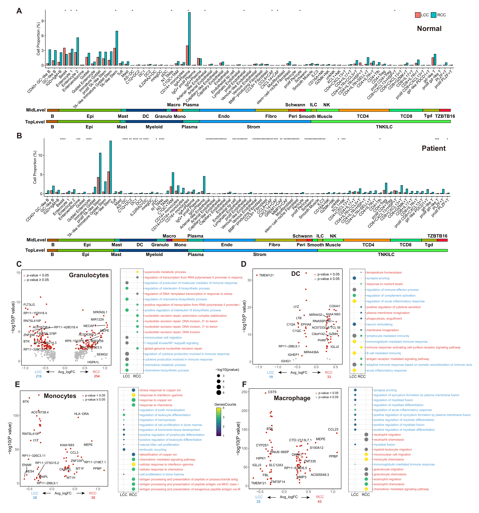
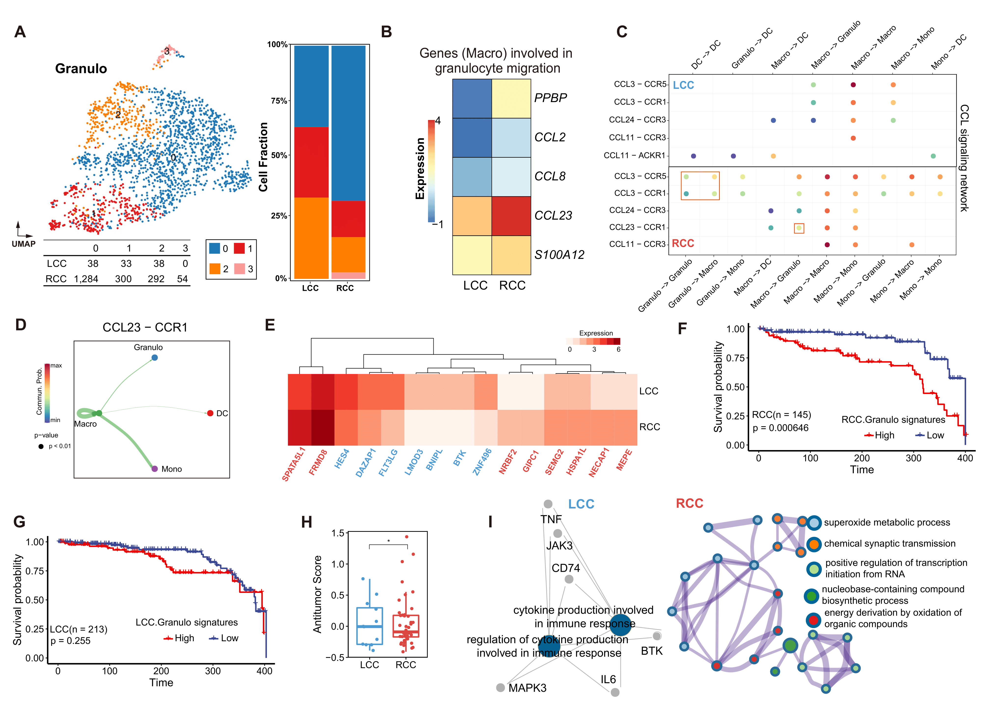
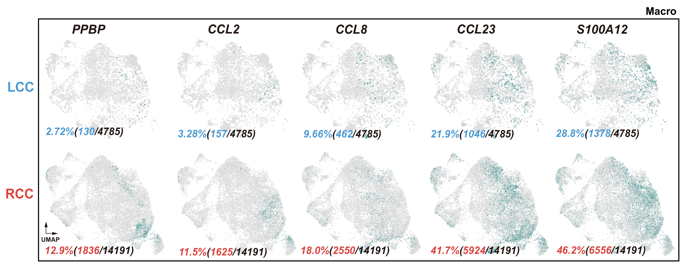
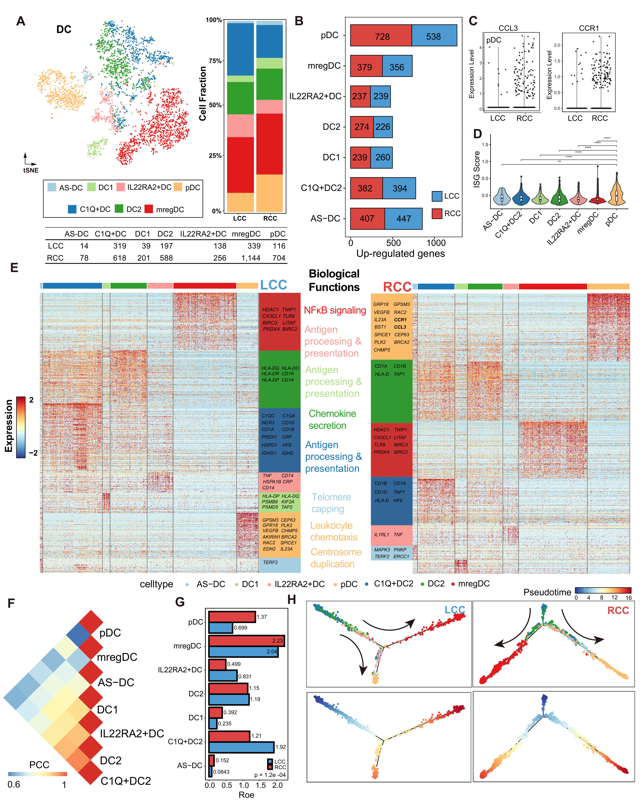
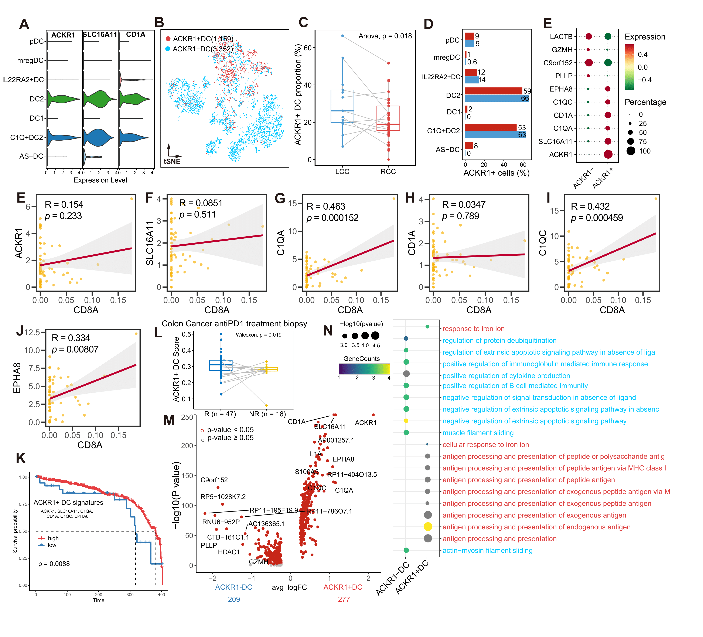
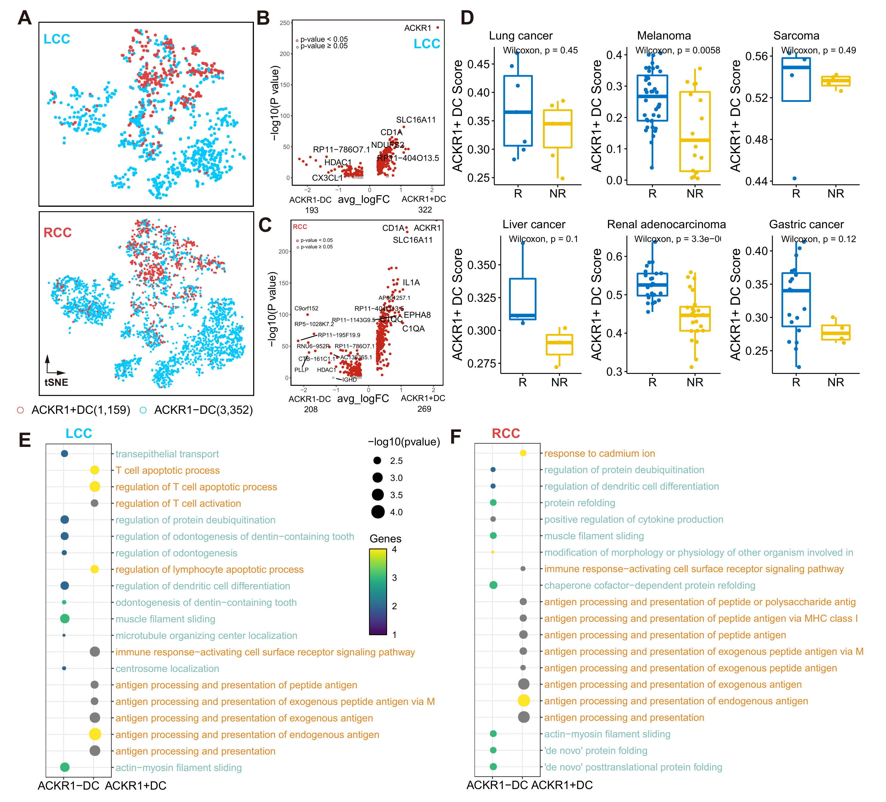
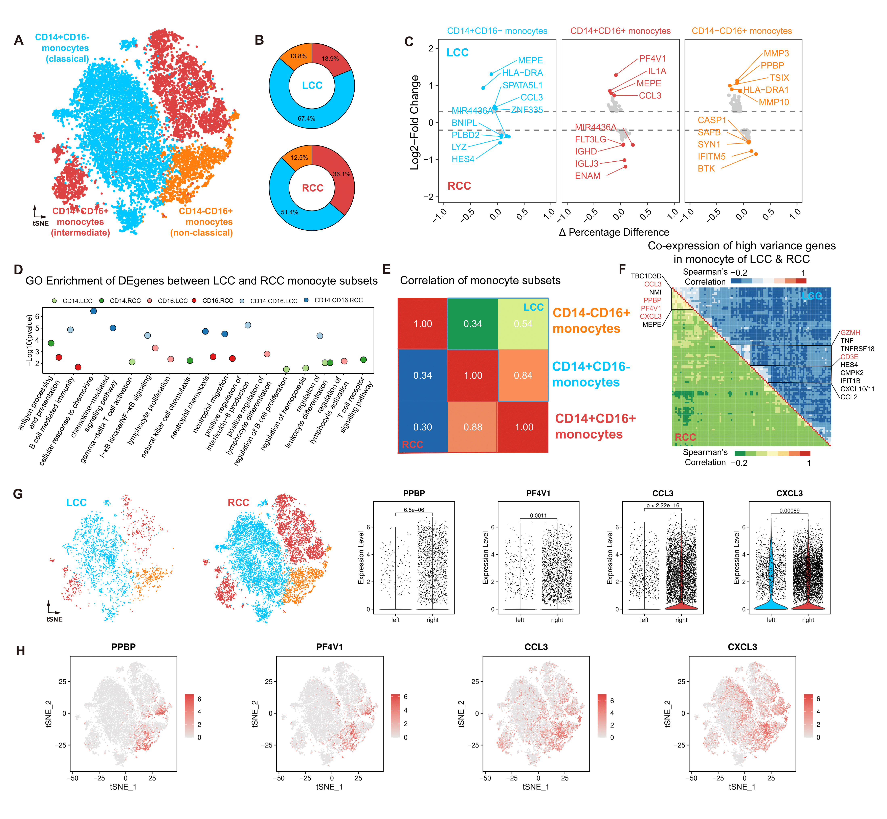
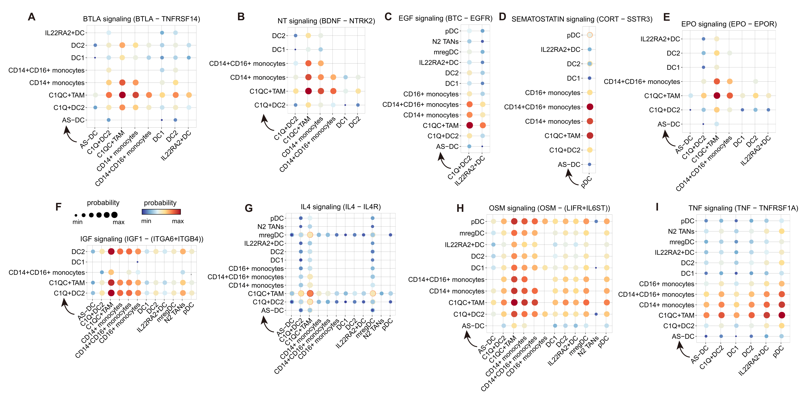

### Code for main figures

**Figure 1 Myeloid lineage microenvironment between LCC and RCC**

**(A)** t-SNE plot showing the transcriptome landscape of 370,115 cells from datasets of 62 CRC patients. Proportions of the global cells in left-sided and right-sided CRC were shown. **(B)**, 39,167 myeloid cells from solid tumor tissues were extracted from the dataset. Porpotions of the myeloid lineages in left-sided and right-sided CRC were shown. **(C)** The fraction of the 4 myeloid subpopulations that originated from left-sided (blue) and right-sided (red) CRC samples were presented. **(D)** A volcano plot of DEGs (differential expressed genes) that were up-regulated (avg_logFC > 0.25, p-value < 0.05) or downregulated (avg_logFC < -0.25, p-value < 0.05) between left-sided and right-sided CRC. **(E)** Heatmap of all DEGs showed that tumorigenesis-asscoaited genes that were up-regulted in right-sided CRC, while immune-related genes that were up-regulated in left-sided CRC.

**Figure S1. Heterogeneity of cell poprotions and biological functions between left-sided and right-sided CRC**

Cell poprotions between left-sided and right-sided CRC from normal (A) and patient (tumor) samples. Visualization of the DEGs (left) and (right) DEPs (differentially expressed pathways) between left-sided and right-sided CRC from myeloid lineage of granulocytes (C), DC (D), Monocytes (E), and Macrophages (F).

**Figure 2 neutrophils exhibit distinct functionalities between left-sided and right-sided CRC**

**(A)** The UMAP plot showed the distribution of granulocytes. Granulocytes were reclustered into 4 subclusters. The fraction of cells htat originated from left-sided and right-sided CRC samples for 4 subgroups identified in this profile. **(B)** Expression profile of 5 granulocyte-migration-associated genes in macrophages. **(C)** Bubble plot showing the communication probability for selected ligand-receptor pairs. Dot size indicated P-value, colored by communication probability.  Granulocytes-specific ligand-receptor pairs were highlighted. **(D)** Chord diagram showing preferential interations of granulocytes with various myeloid subclusters mediated by CCL23-CCR1 ligand-receptor pair. **(E)** Expression profile of signatures of granulocytes from left-sided (blue) and right-sided (red) CRC. The Kaplan-Meier overall survival curves of TCGA COAD patients grouped by the right-sided CRC **(F)** and left-sided CRC **(G)** signatures. **(H)** Expression of a antitumor signature across granulocytes from left-sided and right-sided  CRC. Two-sided Wilcoxon test. antitumor signatures contain *TNF*, *ICAM1*, *IFNB1*, *CCL3*, *TNFSF10*, *IL21*. **(I)** Differential pathway enriched in granulocytes from left-sided and right-sided CRC.

**Figure S2 Genes involved in granulocyte migration** 

UMAP visualization showing the expression of selected genes in macrophages of left-sided and right-sided CRC.

**Figure 3 Heterogeneity and dynamics of DC subsets between left-sided and right-sided CRC**

**(A)** The t-SNE plot showing the distribution of DCs. DCs were clustered into 7 subclusters. The fraction of cells that originated from left-sided and right-sided CRC samples for 7 subgroups identified in this profile. **(B)** Number of up-regulated genes in each DC subset between left-sided and right-sided CRC. **(C)** Expression of CCL3 and CCR1 in left-sided and right-sided CRC. **(D)** Violin plot showing the ISG (IFN-stimulated genes) score across DC subsets in CRC. ISG signatures, *MX2*, *ISG15*, *IRF7*, *BST2*, *IFITM2*, and *IFI27*. **(E)** Heatmap of DEGs and DEPs in DC subsets (padj < 0.01, and avg_logFC > 0.25). The expression of each gene was centered to the average expression across DC subsets with a scale from -2 to 2. **(F)**. Correlations of all DC subsets. Pearson Correlation Coefficient was applied. **(G)**. Tissue prevalence estimated by Ro/e score. **(H)** Differentiation trajectory of DC subsets in CRC, with each color coded for pseudotime and clusters.

**Figure 4 Immunological ACKR1+ DC were prevalent in left-sided CRC**

**(A)** Violin plot showing the expression of ACKR1, SLC16A11, CD1A. **(B)** t-SNE plot showing the distribution of ACKR1+ DC. **(C)** Boxplot showing the proportions of ACKR1+ DC in left-sided and right-sided CRC. **(D)** Barplot showing the proportion of ACKR1+ DC across all DC subclusters. **(E)** Visualization the expression of ACKR1+ DC  versus ACKR- DC markers. **(E-J)** Dotplot showing the correlation of ACKR1+ DC markers (*ACKR1*, *SLC16A11*, *C1QA*, *CD1A*, *C1QC*, *EPHA8*) and CD8. **(K)** Kaplan-Meier plot showing better clinical outcome in colon cancer with higher expression of ACKR1+ DC marker genes. **(L)** Bxoplot showing the AKCR1+ DC score over reponse (R) and non-response (NR) groups in TISMO colon cancer antiPD1 treatment assay. **(M)** Violin plot showing the DEGs between ACKR1+DC and ACKR1- DC cells. **(N)** Dotplot showing the DEPs between ACKR1+ DC and ACKR1- DC.

**Figure S3 ACKR1+ DC is an prominent marker for prognosis**

**(A)** t-SNE plot showing the distribution of ACKR1+ DC over left-sided and right-sided CRC. Violin plot showing the DEGs between ACKR1+ DC and ACKR1- DC in left-sided (**B**) and right-sided CRC (**C**). **(D)**. Box plot showing the AKCR1+ DC score between Response and Non-response group in pancancer antiPD1 treatment assay, including lung cancer, melanoma, sarcoma, liver cancer, renal adenocarcinoma, and gstric cancer. Dot plot showing the DEPs between ACKR1+ DC and ACKR1- DC in left-sided (**E**) and right-sided CRC (**F**).

**Figure 5 Monocytes from right-sided CRC exhibit higher level of granulocyte-migration-related genes**

**(A)** t-SNE plot showing the distribution of monocyte subsets. **(B)** Circle plot showing the
proportion of monocyte subsets between left-sided and right-sided CRC. **(C)** Dot plot showing the DEGs between left-sided and right-sided CRC in monocytes subsets. Top 5 genes were labelled. **(D)** Dot plot showing the GO enrichment terms between left-sided and right-sided CRC in monocyte subset. **(E)** Heatmap showing the correlations between monocytes in left-sided and right-sided CRC. **(F)** Co-expression of variance genes in left-sided and right-sided CRC. **(G)** Visualization of expression of granulocyte-migration-related genes between left-sided and right-sided CRC. **(H)** t-SNE plot showing the expression patterns of granulocyte-migration-related genes in monocytes.

**Figure 6 Tissue-specific ligand-receptor pairs**

Dot plot showing the left-sided-specific **(A)** and right-sided-specific **(B-I)** ligand-receptor pairs.
